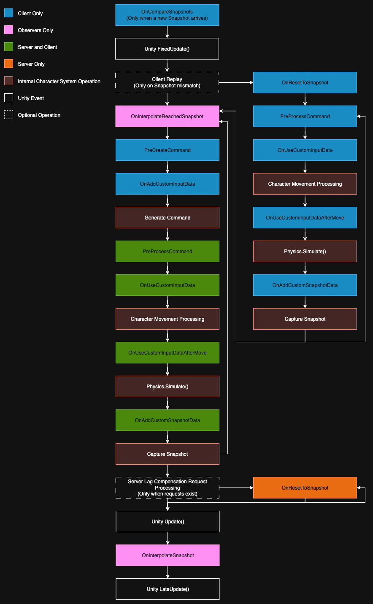

# Architecture


This documentation assumes you have knowledge of the basics of Server Authoritative Networking. Refer to the resources linked in [.](./ "mention") for background information.


## How Character Movement is Processed

Each tick, the client collects the input that the player has given. This input contains information like a move direction, if they want to jump, if they're holding sprint, etc. The client packages this input information into a "Command" and labels it with a command number. Each time the client generates a new command, it increments the command number. Every command that is generated is sent to the server for processing, but the client also predicts the result of the command by immediately processing the command locally.

Both the client and server use the same algorithm to update the position of the character. That means that with the same input command, the server and client _should_ agree on the end result of the command.

In order for the client to check if its predicted result is the same as the server's result, the client stores a snapshot of the character's state after processing each command. The snapshot includes the command number of the last command processed. When the server finishes processing a command, the server also captures a snapshot. The server sends it's snapshot back to the client. Once the server's snapshot has been received, the client can check if it's predicted snapshot ended up being the same as the one the server generated.

If the server and client agree on the result of the command, then nothing happens. The client was correct, so all future commands based on that correct result should also hopefully be correct. However, if the result of processing a command is different on the client and server, the client needs to correct it's predictions. The client does this by resetting the character back to the authoritative snapshot the server provided. Once the character is reset, the client will replay all of the commands after the one that was mis-predicted. As it replays the commands, it overwrites the previous results for each command to generate a new predicted timeline.

## Including Custom Data and Logic in Character Movement Processing


We provide the [predicted-command-manager.md](predicted-command-manager.md "mention") as a framework for extending character movement behavior. The Predicted Command Manager takes care of connecting to the right functions at the right times and ensures that the correct code runs during replays. It is the recommended way to work with server authoritative character movement.


There are various extension points in the character movement process. Generally a combination of multiple connections to these extension points will be required to properly implement modifications to the character movement system.

### Event Diagram

<figure><figcaption></figcaption></figure>

### Notable Events

#### OnCompareSnapshots

This event fires on the client when a new snapshot arrives from the server. By default, the character networking logic doesn't know how to compare the custom data included in a snapshot. This event allows you to add additional comparison logic to the snapshot comparison when it occurs on the client. Use `character.SetComparisonResult()` to update the result for the snapshot when this event fires.

#### OnAddCustomInputData

This event fires when the character networking is generating a new command on the client. You can use `character.AddCustomInputData()` to add additional data to the command. This data will be made available in the `OnUseCustomInputData` event on both the client and server when the generated command is processed.&#x20;

#### OnUseCustomInputData

This event fires when the client or server is processing a command. You can use this event to make changes to the character movement logic based on the custom input data provided. It's important that all information required for your custom logic is included in the input or snapshot data, so that your results are deterministic.

#### OnAddCustomSnapshotData

This event fires when the client or server is creating a snapshot of the character's state. This snapshot is used to determine if the server and client agree on the final results of processing a command. You can use this event to encode additional data to use for comparison by calling `character.AddCustomSnapshotData()`.

#### OnInterpolateSnapshot

This event fires when an observed characters position is being updated for rendering. Observed characters are characters that your local client does not control, it must simply display the snapshots being received. Character interpolation looks at two snapshots and interpolates between them. You can use this function along with `OnInterpolateReachedSnapshot` to modify the rendering of observed characters.
