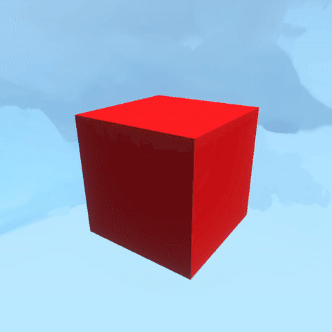

# Easy Helper Utils


[material-color-urp.md](material-color-urp.md)


<figure><figcaption></figcaption></figure>


[easy-motion.md](easy-motion.md)


<figure><figcaption>
Easy Motion
</figcaption></figure>


[easy-grid-align.md](easy-grid-align.md)


<figure><figcaption>
Easy Grid Align
</figcaption></figure>


[easy-look-at.md](easy-look-at.md)


<figure><figcaption>
Easy Look At
</figcaption></figure>


[easy-shake.md](easy-shake.md)


<figure><figcaption></figcaption></figure>


[easy-destroy.md](easy-destroy.md)


<figure><figcaption>
Easy Destroy
</figcaption></figure>


Some helpers are C# instead of typescript so they are more performant, can run in Editor mode, and have custom inspectors.&#x20;

